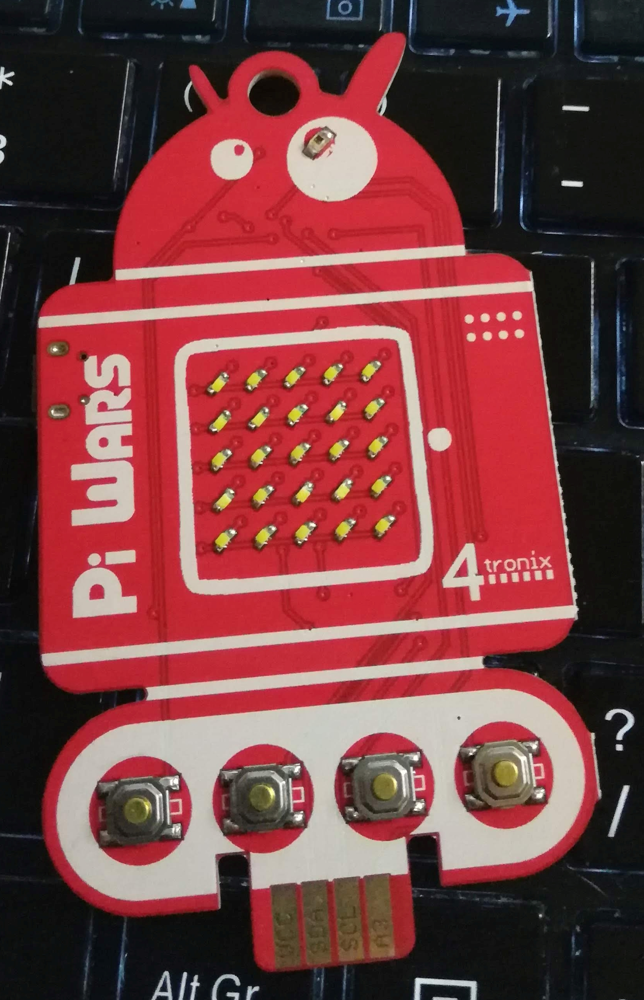

# Pi Wars 2019 Badge

## Introduction
The Pi Wars 2019 Badge has an ATmega chip on-board, which means that to program it, you will need to use Arduino C code.
To code and upload your program to the Badge, you will need to use a piece of software called the Arduino IDE.
Don't worry if you're not used to programming Arduinos. The syntax is different but the concepts are the same. There
are numerous tutorials out there which explain the basics. Programs on Arduinos are called "sketches" and we have supplied
and uploaded a sample sketch for you to play around with.

You'll notice that the Badge robot has a bit of a 'tail'. This breaks out some of the ATmega function pins and allows the use
of the Badge as the driver for some add-ons available from 4tronix. You could also solder directly onto them if you so wish.
Bear in mind that the pins on one side are different from those on the other so you can't use crocodile clips!

## Installing the Arduino IDE
[Download the Arduino IDE for your computer from the Arduino website](https://www.arduino.cc/en/main/software)

Install the software and then run the IDE.

*Please note, if you’re on a Linux machine, you’ll need to run the IDE as root by doing `sudo ./arduino` in the Arduino program directory.*
*Do this **before** you open the sketch, and before you add the Libraries otherwise you’ll need to do it twice.*

## Installing the libraries
In order to take advantage of the LEDs on the trophy, you will need to install a special library.

Navigate using the main menu to:
`Sketch->Include library->Manage libraries`

Allow the list to update. Then search for *FastLED* by Daniel Garcia.
Install it. (This allows you to program the LEDs).

Then close the Manager.

## Uploading a sketch
To program the Badge from the Arduino IDE, use `Arduino Uno` as the board and choose `Arduino as ISP` as the programmer.

You’ll need to change the Port in the tools menu. The best thing to do is to check the list before you plug in the Badge, plug in the Badge
and then see what’s changed on the list. For instance, on my Linux laptop, `/dev/ttyUSB0` comes up and on my
Windows laptop, `COM3` comes up.

Once you're ready to upload, plug the Badge into your computer using a microUSB cable, wait a few seconds while the Badge boots up and then
press the upload button on the Arduino IDE. Any errors will appear in the log at the bottom of the IDE.

### Please note - USB cables
*Not all USB cables are the same!*
You need one that has a **data line**. These tend to be the thicker, more robust USB cables.
If no port appears, you’ve got a cable without a data line.
Data line USB cables tend to come with mobile phones as they use them to sync with your main computer.
Generally you can find these cables by explicitly searching, for example, on eBay for a *micro USB data cable*.

## About the sample sketch
You can download the sample sketch from the GitHub repository and then open it in the Arduino IDE. It is heavily commented and this
should help you understand what's going on. Here are some notes on how the sample sketch works in terms of button presses and
functionality:
* Gareth over at 4tronix wrote the software. He's called it BadgeOS because it's slightly more complicated than a standard sketch.
* On boot, the sketch will scroll a message.
* Most of the code is concerned with controlling the LEDs.
* There is a note in the code about where to place your own code. The `progMain()` function is where the majority of your code should go, to respond to button presses.
* The four buttons are numbered 0-3.
* Pressing button 0 will scroll the message defined by the `text2` variable above the function (by default PiWars 2019)
* Pressing button 1 will scroll the message defined by the `text1` variable about the function (by default 0123456789)
* Pressing button 2 will read the light sensor in the eye of the Badge and print out its value. These light sensors aren't brilliant and sometimes give variable readings.
* Pressing button 3 will play an animation of some squares. Please be aware that this flashes quite a bit and should be used in moderation! You might want to slow the animation down.
* You'll see some robot code (motors and suchlike) - this is for the round robot add-on that you can get from 4tronix.
