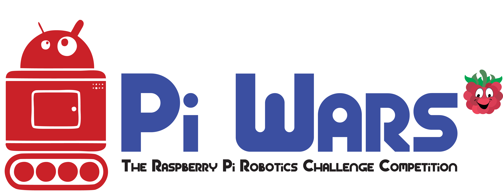
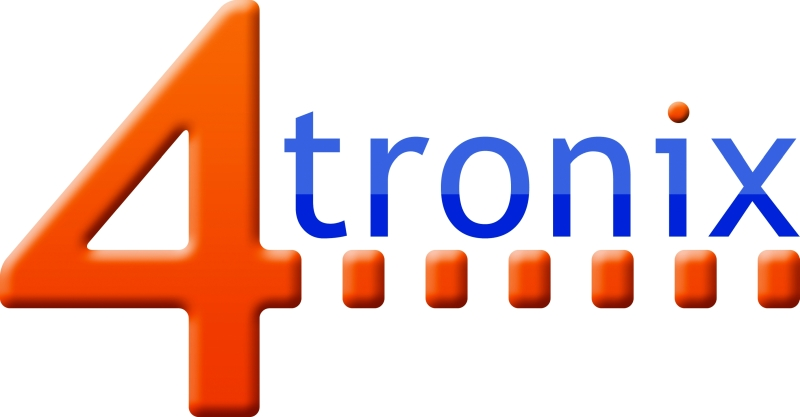

# Pi Wars 2019
Code and documentation for Pi Wars 2019.

For 2019, we have issued competitors with [Pi Wars Badges](Badge/). These have been designed and produced by Gareth over at
[4tronix](https://shop.4tronix.co.uk/).

Also from Gareth were this year's [Pi Wars Trophies](Trophy/). These were programmed by Michael Horne (@recantha) with help from Gareth.

All the code and documentation will appear here, along with schematics.

For help, please [contact Pi Wars through the website](https://piwars.org/contact/) so that we can direct your query appropriately.

## Special thanks
Thank you to Mike's wife, Tracey, for kindly sponsoring the lanyards that were issued with the badges.